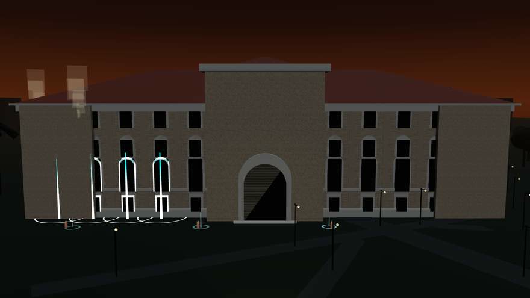

# Doheny Rescue

<p align="center">
  
</p>

<p align="center">
  <strong>Doheny is on fire.</strong><br />
  <a href="https://usc-search-rescue.vercel.app">Play live</a>
</p>

Fire is already in the stacks at Doheny Memorial Library. You drive a ground robot on the Alumni Park lawn and save people outside the windows. Assess the scene, then pull out who you can reach. You cannot go inside.

## A run

A short briefing holds the clock. Deploy from the red ring. Thermal starts on. Rooms smoke, then vent.

1. Drive to a marked opening and stop.
2. Press Space to assess. Thermal only shows heat until you do.
3. Press F to rescue who you can reach. Mark the rest. They walk to staging.
4. When a room vents that opening dies.
5. The run ends when every cell has vented.

Debrief lists each person in encounter order: what you saw, what you did, what was true. No grade.

You cannot die. The robot stays at full speed.

## Controls

| Input | What it does |
| --- | --- |
| **W / S** or knob | Throttle |
| **A / D** or knob | Steer |
| Scroll | Zoom |
| **T** | Toggle thermal |
| **Space** | Assess (stop at an opening) |
| **F** | Rescue |
| **Enter** | Next, then Deploy |

## Develop

```bash
npm install
npm run dev
```

Dev server is port `43147`. First run fetches public textures.

```bash
npm run test:site
npm run build
```

## Credits

© OpenStreetMap contributors (ODbL). Attribution also lives on the Credits screen.

The photograph above is a frame from the sim, looking north across Alumni Park at the south face.

Facade maps in the sim are derived from [Doheny Library](https://commons.wikimedia.org/wiki/File:Doheny_Library.jpg) by Padsquad19, Wikimedia Commons, CC BY-SA 3.0.

Built with Vite, React, TypeScript, Three.js, React Three Fiber, Drei, and zustand.
